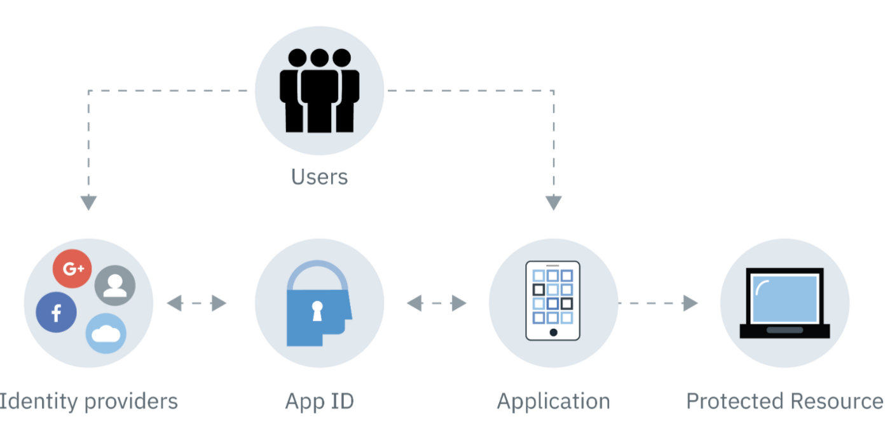

# Aplicación de muestra de IBM Cloud App ID React

El SDK de IBM Cloud App ID se puede utilizar con React para crear una aplicación segura de una sola página. Necesitará una instancia de IBM Cloud App ID con una aplicación de una sola página creada. Utilice el ID de cliente y el extremo de detección de las credenciales de su aplicación para inicializar la instancia de ID de la aplicación.

<p align="center">
	
</p>

## Requisitos previos

- Node.js versión 8 o posterior
- Administrador de paquetes npm
- Instancia de [IBM Cloud App ID](https://cloud.ibm.com/catalog/services/app-id) con [credenciales de SPA](https://cloud.ibm.com/docs/services/appid?topic=appid-single-page#create-spa-credentials)
- Un [URI de redirección](https://cloud.ibm.com/docs/services/appid?topic=appid-managing-idp#add-redirect-uri) establecido en el panel de control del servicio App ID

## Correr localmente

1. Clonar el repositorio.

```
git clone https://github.com/HiroForYou/react-crud-with-ibm-serveless.git
```

2. Navegue a la carpeta del espacio de trabajo de la aplicación.

```
cd react-crud-with-ibm-serveless
```

3. Instalar dependencias para la aplicación.

```
npm install
```

4. Inicie el servidor de desarrollo. Navegue a http://localhost:3000 para acceder a su aplicación.

```
npm start
```

## Instrucciones detalladas sobre cómo crear su aplicación

1. Configure una canalización de compilación de frontend usando create-react-app. Luego muévase al directorio del proyecto.

```
npx create-react-app my-app
cd my-app
```

2. Instale el SDK de IBM Cloud AppID.

```
npm install ibmcloud-appid-js
```

3. En su editor de código, en el directorio src de la aplicación, abra el archivo App.js. Importe el ID de la aplicación agregando el siguiente código:

```
import AppID from 'ibmcloud-appid-js';
```

4. En la función principal App(), declare una nueva instancia de ID de aplicación con useMemo, que vuelve a calcular un valor memorizado cuando cambia una dependencia.

```
const appID = useMemo(() => {
    return new AppID()
}, []);
```

5. Inicialice la ID de la aplicación y agregue el manejo de errores. Agregue su [ID de cliente y endpoint de descubrimiento](https://cloud.ibm.com/docs/services/appid?topic=appid-single-page#create-spa-credentials) que se puede encontrar en la pestaña Aplicaciones de la Panel de identificación de la aplicación.

```
const [errorState, setErrorState] = useState(false);
const [errorMessage, setErrorMessage] = useState('');
(async () => {
    try {
      await appID.init({
        clientId: '<SPA_CLIENT_ID>',
        discoveryEndpoint: '<WELL_KNOWN_ENDPOINT>'
      });
    } catch (e) {
      setErrorState(true);
      setErrorMessage(e.message);
    }
})();
```

6. Cree una acción de inicio de sesión que se ejecutará cuando se haga clic en el botón de inicio de sesión. Después de una autenticación exitosa, welcomeDisplayState se establecerá en _true_ y el nombre de usuario se establecerá en el nombre devuelto en el token de ID de la aplicación.

```
const [welcomeDisplayState, setWelcomeDisplayState] = useState(false);
const [loginButtonDisplayState, setLoginButtonDisplayState] = useState(true);
const [userName, setUserName] = useState('');

const loginAction = async () => {
  try {
    const tokens = await appID.signin();
    setErrorState(false);
    setLoginButtonDisplayState(false);
    setWelcomeDisplayState(true);
    setUserName(tokens.idTokenPayload.name);
  } catch (e) {
    setErrorState(true);
    setErrorMessage(e.message);
  }
};
```

7. Agregue un div de bienvenida, el botón de inicio de sesión que llama a la acción de inicio de sesión y un div de error.

```
{welcomeDisplayState && <div> Welcome {userName}! You are now authenticated.</div>}
{loginButtonDisplayState && 
<button style={{fontSize: '24px', backgroundColor: 'skyblue', border: 'none', cursor: 'pointer'}} id='login' onClick={loginAction}>Login</button>}
{errorState && <div style={{color: 'red'}}>{errorMessage}</div>}
```

8. Save all of the files. Your entire App.js file should look like this:

```
import React from 'react';
import logo from './logo.svg';
import './App.css';
import AppID from 'ibmcloud-appid-js';

function App() {
    const appID = useMemo(() => {
        return new AppID()
    }, []);

    const [errorState, setErrorState] = useState(false);
    const [errorMessage, setErrorMessage] = useState('');

    (async () => {
      try {
        await appID.init({
          'clientId': '<SPA_CLIENT_ID>',
          'discoveryEndpoint': '<WELL_KNOWN_ENDPOINT>'
        });
      } catch (e) {
        setErrorState(true);
        setErrorMessage(e.message);
      }
    })();

    const [welcomeDisplayState, setWelcomeDisplayState] = useState(false);
    const [loginButtonDisplayState, setLoginButtonDisplayState] = useState(true);
    const [userName, setUserName] = useState('');

    const loginAction = async () => {
    try {
        const tokens = await appID.signin();
        setErrorState(false);
        setLoginButtonDisplayState(false);
        setWelcomeDisplayState(true);
        setUserName(tokens.idTokenPayload.name);
      } catch (e) {
        setErrorState(true);
        setErrorMessage(e.message);
      }
    };
 
    return (
        <div className='App'>
          <header className='App-header'>
            
            {welcomeDisplayState && <div> Welcome {userName}! You are now authenticated.</div>}
            {loginButtonDisplayState && 
                <button 
                    style={{fontSize: '24px', backgroundColor: 'skyblue', border: 'none', cursor: 'pointer'}}
                    id='login' onClick={loginAction}>Login</button>}
            {errorState && <div style={{color: 'red'}}>{errorMessage}</div>}
          </header>
        </div>
    );
}
export default App;
```

9. Abre tu terminal. Ejecute el siguiente comando para acceder a su aplicación desde http://localhost:3000.

```
npm start
```

10. Asegúrese de registrar su redirección_uri (en este caso, http://localhost:3000/\*) con el ID de la aplicación para garantizar que solo los clientes autorizados puedan participar en el flujo de trabajo de autorización. Esto se puede hacer en el panel de ID de la aplicación en la pestaña Administrar autenticación en la Configuración de autenticación. Haga clic [aquí](https://cloud.ibm.com/docs/services/appid?topic=appid-managing-idp#add-redirect-uri) para obtener más detalles.

¡Bien hecho! Ha integrado correctamente el SDK de IBM Cloud App ID para SPA en una aplicación React.
